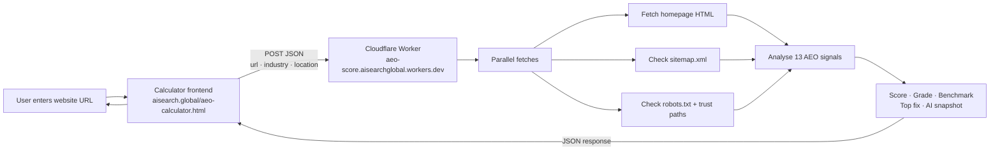

# AEO Calculator — Architecture

## Request flow



## Stack

| Layer | Technology | URL |
|---|---|---|
| Frontend | Static HTML (Cloudflare Pages) | `aisearch.global/aeo-calculator.html` |
| Scoring function | Cloudflare Worker | `aeo-score.aisearchglobal.workers.dev` |
| DNS | Cloudflare | — |

## Local development

```bash
cd cloudflare
wrangler dev          # serves Worker on localhost:8787
```

The calculator frontend detects `file:` protocol and automatically calls `localhost:8787` instead of the production Worker.

## Signals analysed (13)

| Signal | Weight |
|---|---|
| Title tag | 8 pts |
| Meta description | 8 pts |
| H1 present | 8 pts |
| Word count ≥ 700 | 8 pts |
| JSON-LD schema | 12 pts |
| FAQ section | 12 pts |
| About page link | 8 pts |
| Contact page link | 8 pts |
| Reviews / testimonials | 8 pts |
| Location mentioned | 6 pts |
| Industry keywords | 6 pts |
| Sitemap present | 4 pts |
| Robots.txt present | 4 pts |
| Trust page count (bonus) | up to 8 pts |
| Sitemap URL count (bonus) | up to 10 pts |
| Internal link count (bonus) | up to 4 pts |

Raw score is calibrated against a `DOMAIN_CALIBRATION` table for known large sites before grading.

## Response shape

```json
{
  "domain": "example.com",
  "score": 74,
  "grade": "B",
  "label": "Above Average Visibility",
  "aiView": "...",
  "mentionProbability": 68,
  "recommendationLikelihood": 74,
  "surfaceType": "owned website",
  "benchmark": { "industryAverage": 58, "topPerformer": 86, "gapToAverage": 16 },
  "fix": "Add a FAQ section with FAQPage schema markup...",
  "gain": "+8 to +12 points"
}
```
